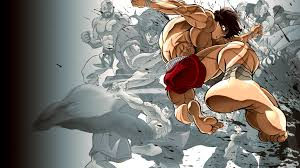
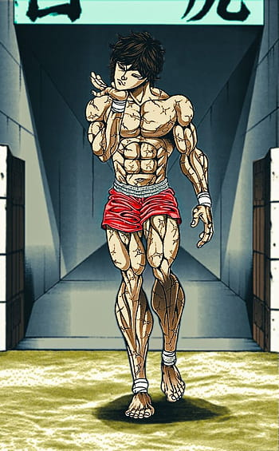

# Anime Series: Baki Hanma

# The Main Character Baki Hanma (He is known as the "Champion" and "the World's Strongest Boy")

## The Story All About?
### Baki Hanma is a young man born into a family of legendary fighters who aspires to surpass his father, Yujiro Hanma, who is considered the strongest on Earth. Baki's journey begins with his mother, Emi Akezawa, and grandfather, Doppo Orochi, both martial artists. As he grows older, he enters the underground martial arts scene, encountering skilled fighters with unique styles and techniques. His struggle with his father, Yujiro, serves as a symbol of his internal struggles and relentless pursuit of excellence. Baki's quest for martial perfection drives him to travel the world, training under different masters and learning from diverse martial arts disciplines. His journey also explores themes of purpose, legacy, and personal fulfillment. Baki Hanma's story is a gripping tale of ambition, determination, and the pursuit of greatness in the face of seemingly insurmountable challenges.

## Main Characters
|Characters|Info|
|----------|----|
|Baki Hanma| Baki Hanma, the protagonist of the Baki the Grappler franchise, takes his father's footsteps and fights in the no-rules arena at 15. He is the "Champion" of the Underground Arena in Tokyo Dome and is often referred to as "the World's Strongest Boy."|
|Yuujirou Hanma| Yuujirou Hanma, Baki and Jack Hanma's father, is the primary antagonist in the Baki franchise. His son, Yuujirou, works as a highly-paid freelance mercenary and assassin for various governments and organizations. He is often referred to as the Strongest Creature on Earth or the Ogre.|
|Doppo Orochi| Doppo Orochi, a 10th dan karate grandmaster and head of the Shinshinkai Karate School, is a strong character in the series, known by various titles like "God of War," "Man Eater Orochi," "Tiger Slayer," and "Fist Saint."|
|Kaiou Retsu| Kaiou Retsu, a skilled Chinese Kenpo fighter, is a key character in the Baki the Grappler anime and manga series. Initially an antagonist, he later became a main character, initially known as Eishuu Retsu.|
|Gouki Shibukawa| Gouki Shibukawa, a master of jujutsu from Baki the Grappler, is a sixty-year-old character who trains in the underground fighting arena and is often referred to as "the Master."|
|Kaoru Hanayama| Kaoru Hanayama, a prominent character in Baki the Grappler, is a strong Yakuza in Japan, the second-generation boss of the Hanayama Group, known for his scars and intricate tattoo.|
|Katsumi Orochi| Katsumi Orochi, a 3rd dan Shinshinkai Karate prodigy and the "Lethal Weapon" from Baki the Grappler, is the adopted son of Doppo and Natsue Orochi.|
|Biscuit Oliva| Biscuit Oliva, also known as Bisuketto Oriba, is a fictional character from Baki the Grappler, an assassin and special jailer with an iron body, and his English dubbing name Oliver.|
|Jack Hanma| Jack Hanma is a Canadian pitfighter from the Baki the Grappler series, son of Yuujirou Hanma and Diane Neil. He aspires to surpass his father in strength and martial ability. In the English dub, his name is Jack Xamma.|
|Mitsunari Tokugawa| Mitsunari Tokugawa is a fictional character from Baki the Grappler, an old man who runs the Underground Arena, a place where fighters compete without rules. He is known as the "Noble Elder" and is descended from Tokugawa Mitsukuni.|
|Kozue Matsumoto| Kozue Matsumoto is a fictional character from Baki the Grappler, Baki Hanma's schoolmate and daughter of Kinuyo Matsumoto, who dies in the Underground Arena.|
|Gerry Strydu| Gerry Strydum, a US Army general and Yuujirou's companion, is a key character in Baki the Grappler, often referred to as "Captain Strydum" due to his near-death encounter with Yuujirou.|
|Izou Motobe| Izou Motobe, an old Japanese jujutsu master, trains Baki for fights after losing to Yuujirou and develops new techniques after losing to him.|
|Koushou Shinogi| Koushou Shinogi, a skilled karate fighter and expert in himokiri karate, uses a unique technique to cut opponents' nerves, blood vessels, and lymph ducts, a feat he once fought Baki Hanma.|
|Kureha Shinogi| Kureha Shinogi, a surgical genius and fighter from Baki the Grappler, is the older brother of Koushou Shinogi and known as the "Super Doctor".|
|Kiyosumi Katou| Kiyosumi Katou, a character from Baki the Grappler, is a top student of Doppo Orochi, known as the "Dangerous Lion of Shinshinkai" and believes in no-holds-barred karate.|

## Japanese Manga Artist (Keisuke Itagaki)

### Keisuke Itagaki (板垣恵介, Itagaki Keisuke, born April 4, 1957) is a Japanese manga artist. He is best known for his martial arts series Grappler Baki (1991–1999) and its four sequels, which have sold over 75 million volumes.[1] In 1996, he began working on Garōden, an original work by Baku Yumemakura. He has also collaborated on the series Garōden Boy.
Prior to becoming a manga artist, he served five years in the 1st Airborne Brigade of the Japan Ground Self-Defense Force.[2] During his service he practiced amateur boxing, and has competed in the National Sports Festival. He also holds a degree in Shorinji Kempo, which he has practiced since he was a teenager.
He is the father of Paru Itagaki, Beastars manga author.

## Contents
|Contents|
|--------|
|1	Main characters|
|2	Other characters|
|2.1	Baki the Grappler|
|2.1.1	Underground Arena Saga|
|2.1.2	Childhood Saga|
|2.1.3	Maximum Tournament Saga|
|2.2	Baki|
|2.2.1	Most Evil Death Row Convicts Saga|
|2.2.2	Great Chinese Challenge Saga|
|2.2.3	Godlike Clash of the Kids Saga|
|2.3	Hanma Baki|
|2.3.1	Combat Shadow Fighting Saga|
|2.3.2	Great Prison Battle Saga|
|2.3.3	Pickle Wars Saga|
|2.3.4	Warrior's Struggle Saga|
|2.3.5	Strongest Father and Child Quarrel Saga|
|2.4	Baki-Dou|
|2.5	Baki Dou|
|2.6	Grappler Baki Gaiden: Antonio Igari vs Mount Toba|
|2.7	Baki Gaiden: Scarface|
|2.8	Hanma Baki 10.5 Gaiden: Pickle|
|2.9	Baki Gaiden: Kizudzura|
|2.10	Baki Gaiden: Kenjin|
|2.11	Yuuenchi - Baki Gaiden Manga|
|2.11.1	Novel only|
|2.12	Baki Gaiden: Gaia to Sikorsky|
|2.13	Baki Gaiden: Hana no Chiharu|
|2.14	Grappler Baki (Remake)|

